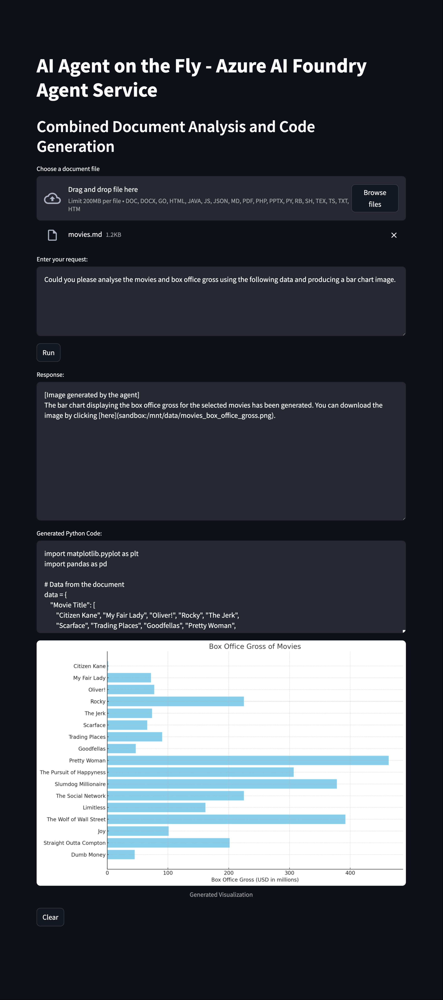
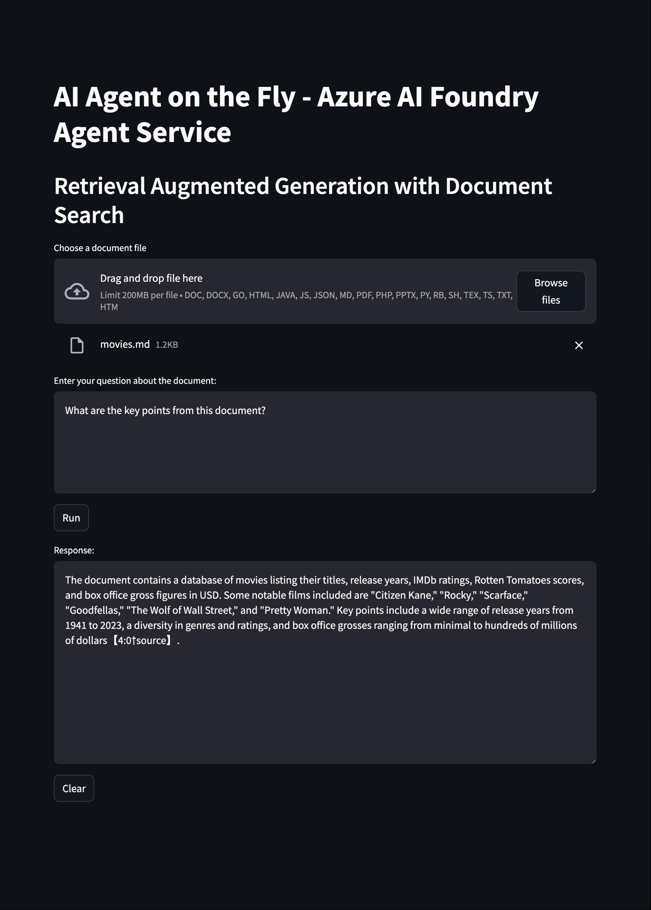
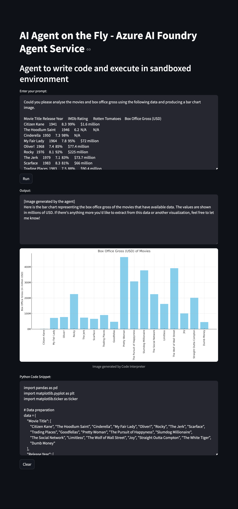

# The Evolution of As-a-Service: Agent as a Service - The Future of On-Demand AI Assistance

The technology industry has witnessed a remarkable progression in service delivery models, from traditional on-premises solutions to increasingly sophisticated cloud-based offerings. As artificial intelligence (AI) reaches new heights, we're now entering the era of Agent as a Service - a revolutionary approach to Agent as a Service (AaaS), representing the next frontier in the as-a-service evolution.

## Agents on Demand: A Cultural Perspective

The concept of summoning specialized agents on demand has long captured our imagination in popular culture:

- **Mission Impossible's IMF Team**: Highly specialized agents assembled for specific missions
- **The A-Team**: "If you have a problem, if no one else can help, and if you can find them..."
- **James Bond's Q Branch**: On-demand technical expertise and gadgets
- **Men in Black**: Specialized agents appearing exactly when needed
- **Ghost Protocol**: Agents operating independently when official channels are down

These cultural touchstones reflect our enduring fascination with the idea of specialized agents ready to tackle specific challenges at a moment's notice - a concept now becoming reality with AI.

## The As-a-Service Evolution

### 1. Infrastructure as a Service (IaaS)
- Basic building blocks of cloud computing
- Virtual machines, storage, and networking
- Pay-as-you-go infrastructure

### 2. Platform as a Service (PaaS)
- Development and deployment platforms
- Managed runtime environments
- Simplified application lifecycle management

### 3. Software as a Service (SaaS)
- Ready-to-use applications
- Subscription-based model
- Minimal setup and maintenance

### 4. Functions as a Service (FaaS)
- Event-driven compute execution
- Serverless architecture
- Automatic scaling of individual functions
- Pay only for execution time
- Popular implementations like AWS Lambda, Azure Functions

### 5. Agent as a Service (AaaS)
The newest paradigm combining autonomous AI agents with cloud-based delivery, representing a significant leap forward in service automation and intelligence.

Agent as a Service represents a paradigm shift in how we deploy and utilize AI agents. Unlike traditional static AI services, these agents are:

- **Instantly Available**: Spin up exactly when needed
- **Purpose-Built**: Configured for specific tasks or domains
- **Ephemeral**: Exist only for the duration of their mission
- **Resource Efficient**: Consume resources only when active
- **Highly Specialized**: Optimized for their designated purpose

## What Exactly is AaaS?

AaaS leverages AI agents capable of performing tasks independently. These agents use machine learning and natural language processing (NLP) to respond to user requests, automate complex workflows, and improve operational efficiency. For newcomers, machine learning refers to algorithms that learn patterns from data, while NLP (Natural Language Processing) enables agents to understand and generate human language. Similar to SaaS, AaaS relies on cloud-based delivery, making it scalable and accessible for businesses of any size.

### The Anatomy of an AI Agent

To understand AaaS, it helps to know what makes up an AI agent:

- **Reasoning Engine**: Powered by large language models (LLMs), this is the brain that processes inputs and makes decisions.
- **Knowledge Base**: A repository of data (similar to an organized database) that the agent pulls from to complete tasks.
- **Memory**: Short-term memory that helps agents manage ongoing conversations or tasks (comparable to session storage in Azure Functions).
- **Tools and Actions**: External APIs or software that agents use to execute tasks (much like invoking Azure Function Apps for specific operations).
- **Planning Module**: Breaks down high-level goals into manageable steps (comparable to task orchestrators like Azure Logic Apps).

## What Makes AaaS Different?

AaaS represents a paradigm shift in service architecture, designed specifically to simplify deployment and scaling of AI agents. Built on serverless principles, AaaS provides:

- **True Serverless Execution**: No infrastructure management required
- **Message-Driven Agent Activation**: Agents spin up on-demand
- **Automatic Resource Management**: Dynamic allocation and deallocation
- **Pay-per-execution Model**: Cost based on actual agent usage
- **Infinite Scalability**: Seamless scaling from zero to enterprise load
- **Built-in State Management**: Stateless execution with managed state
- **Cold/Warm Start Optimization**: Intelligent agent instance management

These agents can:
- Scale automatically based on demand
- Deploy across multiple regions
- Handle complex distributed workflows
- Integrate seamlessly with existing infrastructure
- Self-heal and recover from failures

## The Architecture of AaaS

### Serverless Foundation

1. **Message-Driven Core**
   - Message-based agent activation
   - Asynchronous processing

2. **Stateless Design**
   - Ephemeral compute instances
   - External state storage
   - Session management

3. **Auto-scaling Infrastructure**
   - Zero to N scaling
   - Concurrent execution
   - Resource throttling
   - Usage metering

## Azure AI Agent Service Overview

Azure AI Agent Service is a fully managed service that simplifies the development, deployment, and scaling of AI agents. It eliminates the complexity of managing infrastructure while providing robust tools for building extensible AI agents.

### Key Features

1. **Automatic Tool Calling**
    - Server-side handling of tool calls
    - Simplified integration with external services
    - Streamlined workflow automation

2. **Secure Data Management**
    - Thread-based conversation state management
    - Built-in security features
    - Compliant data handling

3. **Pre-built Tool Integration**
    - Bing integration
    - Azure AI Search compatibility
    - Azure Functions support
    - Code interpreter tools
    - File handling capabilities

### Infrastructure Management
- Automated provisioning
- Dynamic scaling
- Load balancing
- Resource optimization

### Security and Compliance
- Identity and access management
- Network isolation
- Encryption at rest and in transit
- Compliance certifications

### Operational Excellence
- Automated updates
- Performance monitoring
- Disaster recovery
- Backup management

## Benefits of Using Azure AI Agent Service

1. **Serverless Operations**
   - No infrastructure management
   - Automatic scaling from zero
   - Pay-per-execution pricing
   - Built-in fault tolerance
   - Instant deployment
   - Global availability

2. **Simplified Development**
    - Reduced code complexity
    - Fast implementation
    - Built-in best practices

3. **Enterprise-Grade Security**
    - Managed authentication
    - Secure data handling
    - Compliance-ready infrastructure

4. **Scalability**
    - Automatic resource management
    - Elastic computing capabilities
    - Cost-effective scaling

5. **Simplified Operations**
   - Zero-touch deployments
   - Automated scaling
   - Built-in monitoring
   - Simplified maintenance

6. **Enterprise-Grade Architecture**
   - Microservices design
   - Container orchestration
   - Service mesh integration
   - Event-driven patterns

7. **Cost Optimization**
   - Pay-per-use pricing
   - Resource optimization
   - Automatic scaling
   - Shared infrastructure

## Agent On The Fly Project: On-the-Fly RAG and Code Generation

The file `AgentOnTheFly.py` demonstrates a practical blueprint for embedding AI agents into a web application that combines retrieval-augmented generation (RAG) with on-the-fly code generation. This pattern works as follows:

- **Dynamic Agent Instantiation**: Upon uploading a document, the application automatically instantiates an AI agent that creates a vector search index to extract contextual information from the file.
- **Session-Based Context**: The agent establishes session context that preserves state during interaction, ensuring that relevant data is available throughout the conversation.
- **On-the-Fly Code Generation**: By processing user instructions, the agent can generate and execute Python code in real time to perform analyses or create visual outputs.
- **Automated Resource Cleanup**: After completing its task—such as downloading a generated image—the agent terminates, ensuring efficient resource management.

This approach embodies an "agent for hire" model on the fly: you upload a document and the system dynamically creates the necessary backend processes to provide intelligent, context-aware assistance exactly when needed.

### RAG Implementation

The Retrieval-Augmented Generation capability allows agents to dynamically access and utilize knowledge from uploaded documents, enhancing their responses with contextual information.

### Code Interpretation Capabilities

The code interpretation feature allows AI agents to generate and execute Python code in real-time, enabling data analysis, visualization, and other programmatic tasks based on user requests.

### Combined Approach: Code Interpretation + RAG

This combined approach integrates both capabilities:
- **Document Knowledge Access**: Agents can search and retrieve information from uploaded documents
- **Live Code Execution**: Python code is generated and run in real-time 
- **Data-Driven Analysis**: Perform analysis on document contents directly
- **Interactive Visualizations**: Create charts and graphs based on document data
- **Automated Problem Solving**: Generate solutions that combine document knowledge with computational capabilities

## Getting Started

Visit [GitHub repository](https://github.com/rondagdag/azure-ai-agents-web-client)

## The Future of As-a-Service Models

The emergence of AaaS marks a new chapter in the as-a-service story:

1. **From Static to Dynamic Services**
    - Traditional services offer fixed functionality
    - AaaS provides adaptive, learning systems
    - Continuous evolution of capabilities

2. **From Human-Driven to AI-Driven**
    - Reduced dependency on human operators
    - Intelligent automation at scale
    - Proactive problem-solving

3. **From Function to Outcome**
    - Focus shifts from features to results
    - Value-based service delivery
    - Measurable business impact

## Looking Ahead

As we move forward, the serverless nature of AaaS will revolutionize how AI agents are deployed and consumed. The combination of serverless architecture and AI agents creates powerful new possibilities:

- **Event-Driven Intelligence**: Agents automatically respond to triggers and events
- **Elastic AI Computing**: Scale from zero to thousands of concurrent agent instances
- **Cost-Efficient Operations**: Pay only for actual agent execution time
- **Global Edge Deployment**: Automatic distribution to edge locations
- **Hybrid Integration**: Seamless connection with existing serverless functions and services

Organizations that embrace this serverless AI evolution will benefit from:

- Zero infrastructure management overhead
- Automatic scaling and high availability
- Predictable and optimized costs
- Rapid deployment and iteration
- Global reach with local presence

The architectural advantages of AaaS will continue to evolve, enabling organizations to:

- Deploy AI capabilities with minimal operational overhead
- Scale globally with consistent performance
- Maintain high reliability and availability
- Optimize costs through efficient resource utilization
- Accelerate innovation through standardized deployment patterns

